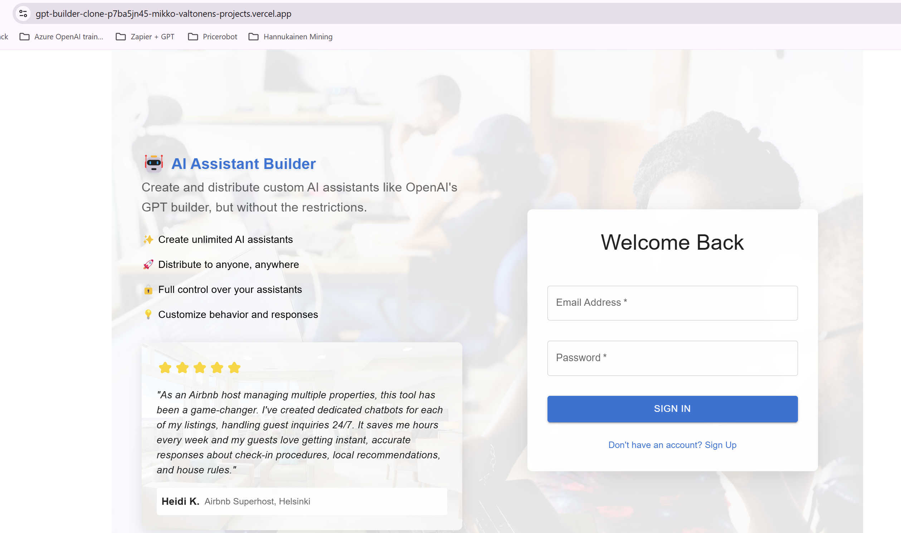

# AI Assistant Builder

A web application for creating and managing AI assistants. Built with React, Material-UI, and Firebase.



Production deployment can be accessed via https://gpt-builder-clone.vercel.app/

## About

AI Assistant Builder is developed by [Mikko Valtonen](https://www.linkedin.com/in/mikkojohannesvaltonen/). It allows you to create and manage custom AI assistants similar to OpenAI's GPT builder, but with more flexibility and control.

For questions, collaborations, or support:
- LinkedIn: [Mikko Valtonen](https://www.linkedin.com/in/mikkojohannesvaltonen/)
- Email: mikko.j.valtonen@gmail.com
- GitHub: [Profile](https://github.com/mikkovaltonen)

## Features

- Create, edit, and delete AI assistants
- Configure assistant roles and behaviors
- Save and manage multiple assistant configurations
- User authentication
- Real-time database synchronization
- Publish assistants with shareable URLs
- Custom AI behavior configuration
- Material-UI based modern interface
- Chat history storage in Firestore
- Nested message structure for better organization

## Local Development Setup

### Prerequisites
- Node.js (v14 or higher)
- npm or yarn
- Firebase account
- OpenAI API key

### Installation Steps

1. Clone the repository:
```bash
git clone [repository-url]
cd GPT-builder-clone
```

2. Install dependencies:
```bash
npm install
```

3. Create a `.env` file based on `.env.example` and add your Firebase and OpenAI configuration:
```env
# Firebase Configuration
REACT_APP_FIREBASE_API_KEY=your_firebase_api_key
REACT_APP_FIREBASE_AUTH_DOMAIN=your_firebase_auth_domain
REACT_APP_FIREBASE_PROJECT_ID=your_firebase_project_id
REACT_APP_FIREBASE_STORAGE_BUCKET=your_firebase_storage_bucket
REACT_APP_FIREBASE_MESSAGING_SENDER_ID=your_firebase_messaging_sender_id
REACT_APP_FIREBASE_APP_ID=your_firebase_app_id

# OpenAI Configuration
REACT_APP_OPENAI_API_KEY=your_openai_api_key
REACT_APP_OPENAI_MODEL=gpt-4
```

4. Initialize Firebase:
```bash
npm install -g firebase-tools
firebase login
firebase init firestore
```

5. Start the development server:
```bash
npm start
```

The application will open at http://localhost:3000

### Available Scripts

- `npm start` - Run the development server
- `npm build` - Build the production bundle
- `npm test` - Run tests
- `npm run eject` - Eject from Create React App (not recommended)

### Troubleshooting

If you encounter issues:
1. Make sure all environment variables are correctly set in `.env`
2. Verify Firebase project configuration matches your `.env` settings
3. Check that your OpenAI API key is valid and has sufficient credits
4. Ensure Node.js version is compatible (v14+)
5. Clear npm cache if needed: `npm cache clean --force`

## Project Structure

- `/src`
  - `/components` - Reusable UI components
  - `/pages` - Main application pages
  - `/config` - Configuration files including Firebase setup
  - `/services` - Service integrations (OpenAI, Firebase)
- `firestore.rules` - Firestore security rules
- `firestore.indexes.json` - Firestore indexes configuration

## Technologies Used

- React
- Material-UI
- Firebase (Authentication & Firestore)
- OpenAI API
- React Router

## Contributing

1. Fork the repository
2. Create your feature branch (`git checkout -b feature/amazing-feature`)
3. Commit your changes (`git commit -m 'Add some amazing feature'`)
4. Push to the branch (`git push origin feature/amazing-feature`)
5. Open a Pull Request

## License

This project is licensed under the MIT License - see the LICENSE file for details.
